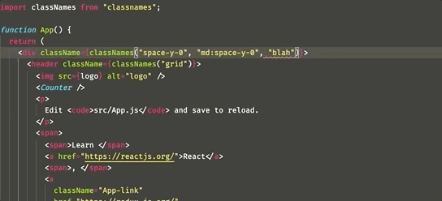

# irontail

[TypeScript Language Service Plugin](https://github.com/microsoft/TypeScript/wiki/Using-the-Language-Service-API) to make classNames()  type-safe for Tailwind.css



## How to use

Just add to tsconfig.json

```
"plugins": [
  {
    "name": "irontail",
  }
]
```

## Why ?

Q. There is already [muhammadsammy/tailwindcss-classnames](https://github.com/muhammadsammy/tailwindcss-classnames). Why is this plugin useful?

A.
`irontail` just provides error checker instead of type generator.

When you use type generator,

- You have to pre-generate typings with CLI
- Intellisense [becomes inferior](https://twitter.com/f_subal/status/1292106949161414656) to existing extensions (like [bradlc.vscode-tailwindcss](https://marketplace.visualstudio.com/items?itemName=bradlc.vscode-tailwindcss))

## References

- [muhammadsammy/tailwindcss-classnames](https://github.com/muhammadsammy/tailwindcss-classnames): The prior art
- [Quramy/ts-graphql-plugin](https://github.com/Quramy/ts-graphql-plugin): Used as reference for the project structure
